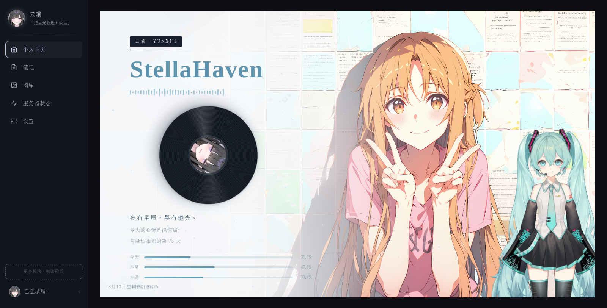
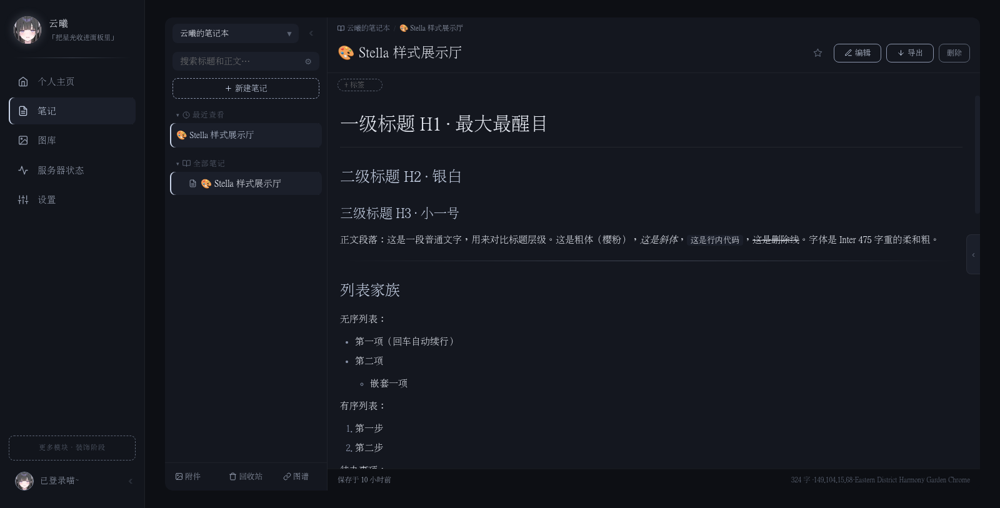
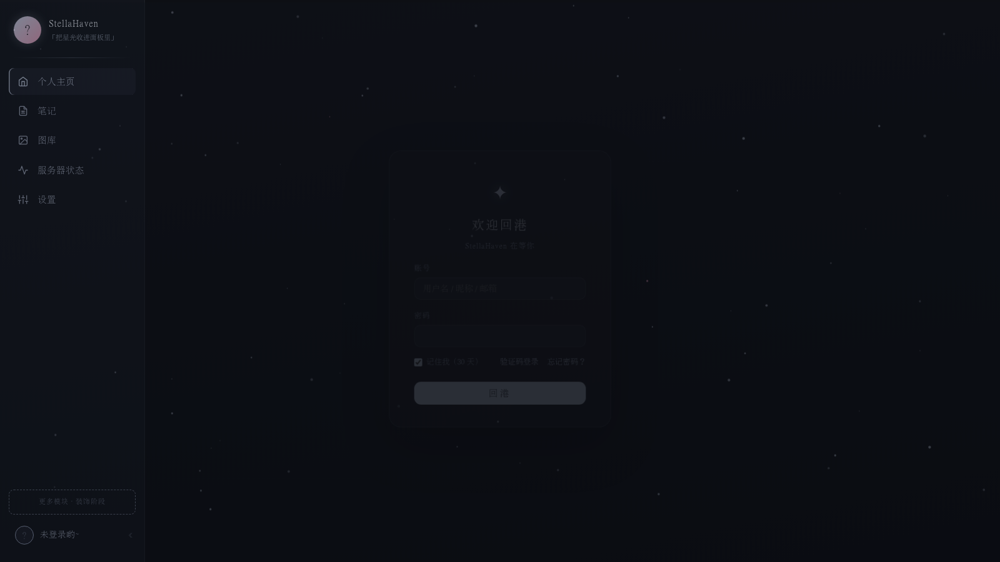

# StellaHaven ✨

> 一个把「个人主页」和「知识库」长在一起的私人数字空间——笔记、图库、塔罗、Live2D 陪伴，以及一套从零手搓的完整账号体系。

<div align="center">
  
  
</div>

---

## 这是什么

StellaHaven 是我（云曦）的个人项目，最初的念头很简单：做一个只属于自己的地方，把笔记、图库、还有每天想看一眼的东西收进来。

它最初是 Flask + 前后端混合的一版原型，后来决定认真做，整体迁移到 **FastAPI + Vue 3**，并补上了最考验后端功底的部分——**一套不依赖第三方库、从零实现的账号与权限体系**。

它不是「照着教程敲出来的 CRUD 演示」，而是一个真正在用的东西：有完整的测试、有 CI、有数据隔离、有实时协同。

## 核心特性

### 🔐 完整账号体系（从零实现）

没有用现成的 auth 框架，登录、会话、验证码、邀请全自己写：

- **三合一登录**：用户名 / 昵称 / 已验证邮箱，任意一个都能登
- **免密验证码登录** + 忘记密码重置
- **JWT（httpOnly cookie）+ refresh token 旋转**：访问令牌 30 分钟短效，刷新令牌哈希落库、可吊销、可多地并存
- **会话看门狗**：30s 巡检，吊销会话即时踢下线
- **邮箱验证**：SMTP 发送验证码，10min 有效期 + 5min 重发限流
- **邀请注册**：公开注册仅限初始化，后续走管理员邀请链接（30min 一链一人）
- **全站标识互斥**：用户名 / 昵称 / 邮箱交叉查重

<div align="center">
  
</div>

### 🛡️ 数据隔离

- workspace / document / attachment / tag / link / version **全部按当前用户过滤**
- 资源不存在时返回 404，**不暴露存在性**（防探测）

### 📝 笔记

- 层级树 + 折叠记忆 + 面包屑导航
- 双链 `[[]]` 自动补全 + 反链面板
- 关系图谱（d3-force 力导向图）
- 标签、附件（粘贴上传 + 引用计数清理）
- 文档版本、回收站、草稿槽、全文搜索
- CodeMirror 6 编辑器 + 实时预览 + PDF / HTML / PNG 导出

### 🏠 主页

- 签名卡 + 塔罗每日一抽（按日期做种子，同一天同一张）
- Live2D 挂件（点击互动：摸头 / 哭哭 / 比心 / 唱歌）+ 3D 挂件（three.js）
- 三套主题（破晓 / 夜泊 / 海岸线）
- 时光进度条、心情便签、自定义背景（图片 / 视频）

### 🔄 WebSocket 实时协同

- 在线状态感知（presence）、编辑中状态、文档变更广播

## 技术栈

| 层 | 技术 |
|:--|:--|
| 后端框架 | FastAPI |
| ORM | SQLAlchemy 2.0 |
| 数据库迁移 | Alembic |
| 数据库 | PostgreSQL |
| 认证 | JWT（HS256）+ refresh 旋转 + argon2 密码哈希 |
| 实时 | WebSocket |
| 前端 | Vue 3 + TypeScript + Vite |
| 状态管理 | Pinia |
| 编辑器 | CodeMirror 6 + marked |
| 图谱 | d3-force |
| 挂件 | pixi-live2d-display / three.js |
| 导出 | html2canvas + jsPDF |
| 测试 | pytest + httpx（94 用例） |
| CI | GitHub Actions |
| 包管理 | uv |

## 快速开始

```bash
# 1. 克隆
git clone git@github.com:Yunxi-Yaoyao/StellaHaven.git
cd StellaHaven

# 2. 装后端依赖（需要 Python 3.13+）
uv sync

# 3. 配环境变量（创建 .env）
cat > .env <<EOF
POSTGRES_HOST=localhost
POSTGRES_PORT=5432
POSTGRES_USER=your_user
POSTGRES_PASSWORD=your_password
POSTGRES_DB=stella
EOF

# 4. 跑数据库迁移
uv run alembic upgrade head

# 5. 启动后端
uv run uvicorn main:app --reload --port 12031

# 6. 启动前端（另开终端）
cd frontend
npm install
npm run dev
```

启动后访问 `http://localhost:5173`（前端）和 `http://localhost:12031/docs`（API 文档）。

> 首次启动会在 `data/secret_key` 自动生成 JWT 密钥；数据库初始化后需通过注册流程创建管理员账号。

## 项目结构

```
StellaHaven/
├── app/
│   ├── config.py          # 配置（pydantic-settings，读 .env）
│   ├── database.py        # engine / session / Base
│   ├── security.py        # 密码哈希 + JWT 签发校验（全站唯一出口）
│   ├── models/            # SQLAlchemy 模型（user/workspace/document/tag/...）
│   ├── schemas/           # Pydantic 请求/响应模型
│   ├── routers/           # API 路由（auth/document/workspace/ws/...）
│   ├── services/          # 业务逻辑
│   └── repositories/      # 数据访问层
├── frontend/              # Vue 3 + TypeScript + Vite
│   └── src/
│       ├── modules/       # 按域拆分的页面模块（auth/notes/home/settings）
│       ├── shell/         # 侧栏等外壳组件
│       ├── api/           # 前端 API 封装
│       └── stores/        # Pinia 状态
├── alembic/               # 数据库迁移
├── tests/                 # pytest（94 用例）
└── .github/workflows/     # CI（push/PR 自动跑测试）
```

## 测试 & CI

- **94 个 pytest 用例**，覆盖认证、文档、工作区、标签、附件、回收站、版本、图谱等模块
- **GitHub Actions CI**：每次 push / PR 自动起 PostgreSQL 容器 + `uv sync` + `pytest`，全绿才放行

```bash
uv run pytest          # 本地跑全部测试
```

## 路线图

- [x] 账号体系 + 数据隔离
- [x] 笔记（双链 / 图谱 / 版本 / 回收站）
- [x] 主页（Live2D / 塔罗 / 主题）
- [x] WebSocket 实时协同
- [x] 附件 / 图库基础
- [ ] 图库完善
- [ ] 服务器状态监控
- [ ] Docker 封装 / 自动化部署

---

*Built with ☕ and late-night coding sessions.*
