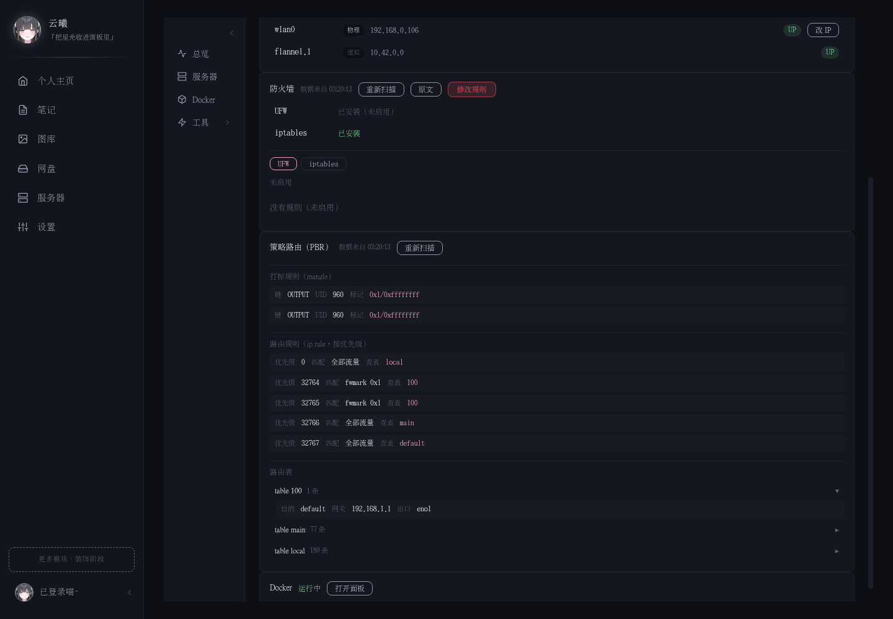

# StellaHaven ✨

> 个人数字空间：笔记、图库、网盘、主页挂件、多服务器监控，带一套自实现的账号体系。

<div align="center">
  
  
</div>

---

## 项目历程

最初是 Flask 前后端混合的原型，用于放笔记和图库。之后整体重写为 FastAPI + Vue 3，逐步补齐账号权限、测试与 CI，随后加入了服务器监控模块（agent 采集 + 任务下发）和网盘/图库的嵌入式整合。

## 功能与设计

### 账号体系

认证授权不依赖第三方框架，全部直接实现，便于完全掌控会话行为：

- **三合一登录**：用户名 / 昵称 / 已验证邮箱任一可登
- **免密验证码登录** + 忘记密码重置
- **JWT（httpOnly cookie）+ refresh token 旋转**：访问令牌 30 分钟短效；刷新令牌哈希落库、可吊销、多端并存
- **会话看门狗**：30s 巡检，被吊销的会话即时踢下线
- **邮箱验证**：SMTP 验证码，10min 有效期 + 5min 重发限流
- **邀请注册**：公开注册仅初始化时开放，之后走管理员邀请链接（30min 一链一人）
- **全站标识互斥**：用户名 / 昵称 / 邮箱交叉查重

<div align="center">
  
</div>

### 数据隔离

- workspace / document / attachment / tag / link / version 全部按当前用户过滤
- 资源不存在或无权限时统一返回 404，**不暴露资源存在性**（防探测）

### 笔记

- 层级树 + 折叠状态记忆 + 面包屑导航
- 双链 `[[]]` 自动补全 + 反链面板
- 关系图谱（d3-force 力导向图）
- 标签、附件（粘贴上传 + 引用计数清理）
- 文档版本、回收站、草稿槽、全文搜索
- CodeMirror 6 编辑器 + 实时预览 + PDF / HTML / PNG 导出

### 主页

- 签名卡 + 塔罗每日一抽（日期做随机种子，同一天恒定同一张）
- Live2D 挂件（点击互动）+ 3D 挂件（three.js）
- 三套主题（破晓 / 夜泊 / 海岸线）
- 时光进度条、心情便签、自定义背景（图片 / 视频）

### 网盘 / 图库（嵌入式整合）

网盘和图库**不重复造轮子**，而是把成熟产品嵌入站内，Stella 负责代管与主题融合：

- **网盘 = OpenList**（Docker 容器）：页面三态（未装 Docker → 未装 OpenList → 已就绪），前端内嵌 iframe，并注入 CSS 做深色主题与背景图对齐（纯色 / 主页壁纸两种模式可切换）
- **图库 = Immich**（Docker 容器）：iframe 嵌入 + 管理浮窗（启动 / 停止 / 重启）；iframe 地址走 Stella 的 `/gallery/connect`（第一方代签 OIDC code 再 302 到 Immich），解决第三方 iframe 上下文里 `SameSite=Lax` cookie 不发送、登录态认不出的问题
- Immich 公网入口用 nginx `sub_filter` 在响应 HTML 里注入样式，把品牌 logo 替换为站内头像

### 服务器监控

多节点纳管，采用 **agent 拉取模型**而非服务端推送：

- **单文件 agent**（`agent/stella_agent.py`，仅依赖标准库 + psutil + httpx，跨 Linux / Windows / 飞牛OS）：被控机只需跑一个脚本，无需在服务端打通到被控机的连接——agent 主动轮询拉任务、主动上报数据，天然穿透 NAT / 防火墙
- **采集**：5s 上报网卡流量（上报即心跳）、60s 上报系统指标；上报失败时数据压内存队列（24h 上限），恢复后按序补传
- **任务下发**：打流（iperf3）、MTR 路由追踪（五类型 × 三触发：手动 / 定时 30min / 失败防抖 10min）、远程命令、防火墙/PBR/Docker 扫描——全部走「服务端建任务 → agent 轮询领取 → 执行 → 回传结果」
- **惰性扫描缓存**：扫描类数据（防火墙规则 / PBR 策略路由 / Docker 容器）读最近一次快照，超过 10 分钟自动后台重扫 + 手动刷新按钮——不设服务端定时任务
- **组件代装**：iperf3 / speedtest / mtr / ufw / docker 缺失时可远程安装，系统命令走 sudoers 白名单（additive，最小授权）
- **自更新**：agent 每 300s 对比服务端版本号，不一致则拉新脚本原地替换重启
- **改 IP 带回滚**：改网卡地址后用 `ping -I <iface>` 验证连通性，不通自动回退（用 root 权限 ping 是为了绕开本机 PBR owner-mark 对 agent 进程的路由劫持）
- **Docker 面板**：容器竖向卡片 + 日志查看（tail ≤500）+ inspect 配置摘要（白名单字段）
- **PBR 结构化**：`ip rule` / 路由表 / iptables mangle 打标链解析为结构化三段展示，而非原始文本

<div align="center">
  
</div>

### WebSocket 实时协同

- 在线状态感知（presence）、编辑中状态、文档变更广播

## 技术栈

| 层 | 技术 |
|:--|:--|
| 后端框架 | FastAPI |
| ORM | SQLAlchemy 2.0 |
| 数据库迁移 | Alembic |
| 数据库 | PostgreSQL |
| 认证 | JWT（HS256）+ refresh 旋转 + argon2 密码哈希 |
| 实时 | WebSocket |
| 前端 | Vue 3 + TypeScript + Vite |
| 状态管理 | Pinia |
| 编辑器 | CodeMirror 6 + marked |
| 图谱 | d3-force |
| 挂件 | pixi-live2d-display / three.js |
| 导出 | html2canvas + jsPDF |
| 节点采集 | 单文件 Python agent（psutil + httpx） |
| 嵌入式服务 | OpenList（网盘）/ Immich（图库），Docker 部署 |
| 测试 | pytest + httpx（121 用例） |
| CI | GitHub Actions |
| 包管理 | uv |

## 部署

### 架构

生产环境是**单端口托管**：前端 `vite build` 产物由 FastAPI 直接托管（SPA fallback 路由），后端同一个端口同时提供 API 和页面，对外只需反代一个地址。

```
浏览器
  │  HTTPS
  ▼
HK 服务器 nginx（stella.xiya.live，TLS 终端）
  │  frp 内网穿透
  ▼
Nyarch 主机 stella-backend（uvicorn :12031）
  ├── SPA 静态托管（frontend/dist）
  ├── API + WebSocket
  └── 同机 Docker：OpenList（网盘）、Immich（图库）等被嵌入服务
```

- 后端 / agent 均为 systemd 服务（`stella-backend` / `stella-agent`）
- 公网入口在另一台 HK 服务器上，nginx 做 TLS 终端后走 frp 隧道回源
- Immich 有独立公网域名（`immich.xiya.live`），nginx 配置含品牌替换的 `sub_filter` 注入，配置副本版本化管理在 `deploy/nginx/`

### 本地开发

```bash
# 1. 克隆
git clone git@github.com:Yunxi-Yaoyao/StellaHaven.git
cd StellaHaven

# 2. 装后端依赖（需要 Python 3.13+）
uv sync

# 3. 配环境变量（创建 .env）
cat > .env <<EOF
POSTGRES_HOST=localhost
POSTGRES_PORT=5432
POSTGRES_USER=your_user
POSTGRES_PASSWORD=your_password
POSTGRES_DB=stella
EOF

# 4. 跑数据库迁移
uv run alembic upgrade head

# 5. 启动后端
uv run uvicorn main:app --reload --port 12031

# 6. 启动前端（另开终端）
cd frontend
npm install
npm run dev
```

启动后访问 `http://localhost:5173`（前端）和 `http://localhost:12031/docs`（API 文档）。

> 首次启动会在 `data/secret_key` 自动生成 JWT 密钥；数据库初始化后需通过注册流程创建管理员账号。

### 生产构建

```bash
cd frontend && npm install && npx vite build   # 产物输出到 frontend/dist
systemctl restart stella-backend               # 后端直接托管 dist，无需单独前端服务
```

> 构建配置里固定了 `cssTarget: "chrome90"`——避免压缩器把 `@media (max-width:768px)` 改写成 range 语法（`(width<=768px)`），旧版 WebView（如部分手机浏览器内核）无法解析会整段丢弃，导致移动端适配失效。

### 纳管新节点

在「服务器 → 节点」页添加节点拿到 token，然后在被控机上跑 `agent/install.sh`（或手动部署 `stella_agent.py --url <stella地址> --token <token>`）。agent 会自动上报并进入监控；缺失的组件可在页面上远程代装。

## 目录结构

```
StellaHaven/
├── app/
│   ├── config.py          # 配置（pydantic-settings，读 .env）
│   ├── database.py        # engine / session / Base
│   ├── security.py        # 密码哈希 + JWT 签发校验
│   ├── models/            # SQLAlchemy 模型
│   ├── schemas/           # Pydantic 请求/响应模型
│   ├── routers/           # API 路由（auth/document/workspace/ws/monitor/drive/gallery/...）
│   ├── services/          # 业务逻辑
│   └── repositories/      # 数据访问层
├── agent/                 # 节点采集 agent（单文件 + install.sh）
├── frontend/              # Vue 3 + TypeScript + Vite
│   └── src/
│       ├── modules/       # 按域拆分（auth/notes/home/drive/gallery/servers/settings）
│       ├── shell/         # 侧栏等外壳组件
│       ├── api/           # 前端 API 封装
│       └── stores/        # Pinia 状态
├── deploy/                # 外部服务配置副本（nginx 等，非自动部署）
├── alembic/               # 数据库迁移
├── tests/                 # pytest（121 用例）
└── .github/workflows/     # CI（push/PR 自动跑测试）
```

## 测试 & CI

- **121 个 pytest 用例**，覆盖认证、文档、工作区、标签、附件、回收站、版本、图谱等模块
- **GitHub Actions CI**：每次 push / PR 自动起 PostgreSQL 容器 + `uv sync` + `pytest`

```bash
uv run pytest          # 本地跑全部测试
```

## 路线图

- [x] 账号体系 + 数据隔离
- [x] 笔记（双链 / 图谱 / 版本 / 回收站）
- [x] 主页（Live2D / 塔罗 / 主题）
- [x] WebSocket 实时协同
- [x] 网盘 / 图库嵌入式整合（OpenList / Immich）
- [x] 服务器监控（agent 采集 / 任务下发 / MTR / 打流 / 防火墙与 PBR / Docker 面板）
- [ ] 防火墙写操作（规则增删 + 校验回退）
- [ ] 移动端适配完善
- [ ] Docker 封装 / 一键部署
